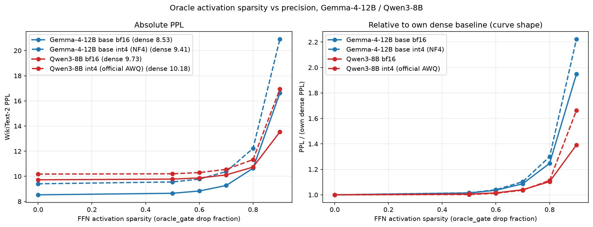

# expr4: PPL vs activation sparsity — Gemma-4-12B / Qwen3-8B, bf16 vs int4

WikiText-2 test PPL (SparseGPT convention, seqlen 2048), oracle_gate per-token
FFN masker, sparsity ∈ {0, 0.5, 0.6, 0.7, 0.8, 0.9}. All runs local (RTX 4090),
HF transformers path (`run_ppl_sweep.py`), full 2026-07-01.

## Configs

| config | checkpoint | precision | note |
|---|---|---|---|
| gemma4-12b-bf16 | google/gemma-4-12B (base) | bf16 | 18GiB VRAM cap + CPU offload |
| gemma4-12b-int4 | google/gemma-4-12B (base) | bnb NF4 | no official base QAT exists (all `-it-`) |
| qwen3-8b-bf16 | Qwen/Qwen3-8B | bf16 | |
| qwen3-8b-int4 | Qwen/Qwen3-8B-AWQ | official AWQ W4A16 | gptqmodel `torch_awq` backend |

Why Gemma runs the BASE model: `gemma-4-12B-it` is turn-format bound — outside
its chat DSL it degenerates ('111.111.'; raw-window PPL ~1000, identically in
HF bf16/nf4 and the vLLM fp8 engine that scores ~55% on tau2; the best
turn-embedded wikitext wrapping still gave ~117). Raw-LM PPL is therefore only
meaningful on the base model. Since Google ships no base QAT int4 for Gemma-4,
the int4 point is bitsandbytes NF4 (the expr3 methodology; rotation-free, so
per-neuron identity is preserved). The Qwen pair is unchanged from the plan.

## Results

PPL (and % over own dense):

| sparsity | Gemma bf16 | Gemma NF4 | Qwen bf16 | Qwen AWQ |
|---|---|---|---|---|
| 0.0 | 8.53 | 9.41 (+10.3% vs bf16) | 9.73 | 10.18 (+4.7% vs bf16) |
| 0.5 | 8.65 (+1.4%) | 9.55 (+1.6%) | 9.78 (+0.6%) | 10.20 (+0.2%) |
| 0.6 | 8.84 (+3.6%) | 9.78 (+4.0%) | 9.87 (+1.5%) | 10.30 (+1.2%) |
| 0.7 | 9.27 (+8.7%) | 10.38 (+10.3%) | 10.11 (+4.0%) | 10.55 (+3.7%) |
| 0.8 | 10.64 (+24.7%) | 12.22 (+29.9%) | 10.74 (+10.4%) | 11.33 (+11.3%) |
| 0.9 | 16.63 (+94.9%) | 20.91 (+122.3%) | 13.54 (+39.2%) | 16.94 (+66.4%) |

## Reading

1. **Quantization and activation sparsity compose up to s≈0.8.** Relative
   curves of bf16 and int4 nearly coincide through s=0.7–0.8 in both families
   (right panel) — same conclusion as expr3 on LLaMA-2-7B, now on 2026-era
   models and with an official deployment artifact (Qwen AWQ).
2. **At s=0.9 int4 breaks first.** The int4 curves peel upward: Gemma +122% vs
   +95% (bf16), Qwen +66% vs +39%. The redundancy that extreme sparsity leans
   on is partly consumed by 4-bit weights.
3. **Qwen3-8B tolerates sparsity better than Gemma-4-12B** at every level
   (s=0.8: +10% vs +25%). The tau2/BFCL operating points chosen earlier
   (s ≤ 0.7–0.8) sit in the flat region for both families.
4. Cross-family absolute PPLs are not comparable (different tokenizers);
   compare within a family only.

## Caveats

- Gemma int4 = post-hoc NF4, not the shipped QAT artifact; the QAT-ct artifact
  is IT-only and unmeasurable by raw PPL. For deployed-artifact int4 behaviour
  use the template-based benchmarks (tau2/BFCL, vLLM path).
- Qwen3-8B is the post-trained release (its raw-LM PPL is healthy, and the
  official AWQ quantizes exactly this model, so the pair is self-consistent).
